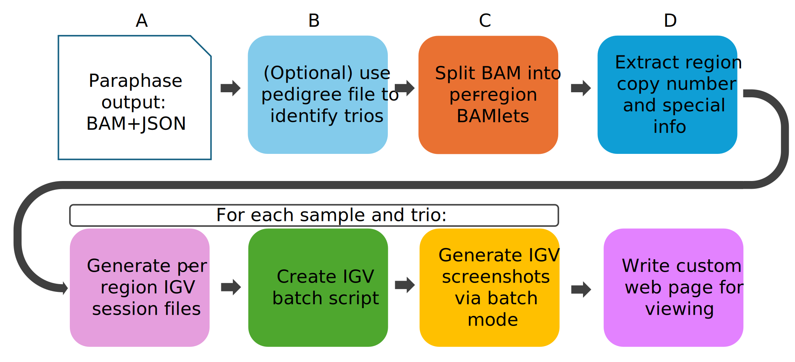

# User Guide

## Installation
### Install with Conda/Mamba
Paraviewer depends on Conda packages, so we recommend installing Paraviewer via mamba as well. 
We recommend creating a dedicated mamba environment for Paraviewer:
```bash
mamba create -n paraviewer_env igv pip "python>=3.10"
mamba activate paraviewer_env
mamba install -y paraviewer -c bioconda
```

### Installation from source

Paraviewer requires conda/mamba installations of pip and IGV even when installing from source.
We recommend creating a dedicated mamba environment for Paraviewer.

Paraviewer can then be cloned and installed from source:
```bash
mamba create -n paraviewer_env igv pip "python>=3.10"
mamba activate paraviewer_env
git clone https://github.com/PacificBiosciences/Paraviewer.git
cd Paraviewer
pip install .
```

Or downloaded from the [GitHub Releases](https://github.com/PacificBiosciences/Paraviewer/releases) page, unzipped, and installed:
```bash
wget https://github.com/PacificBiosciences/Paraviewer/archive/refs/tags/v0.1.0.tar.gz
tar -xzvf v0.1.0.tar.gz
cd Paraviewer-0.1.0/
pip install .
```

To support headless HPC environments, Paraviewer on Linux also requires [Xvfb](https://www.x.org/archive/X11R7.7/doc/man/man1/Xvfb.1.xhtml).

## How to run
### Paraviewer command-line arguments
These can be viewed after installation by running `paraviewer -h` in the terminal.
```text
ParaViewer v0.1.0
usage: paraviewer [-h] [-v] --outdir OUTDIR [--paraphase-dir PARAPHASE_DIR] [--ptcp-dir PTCP_DIR] [--clobber] --genome {hg19,hg38} [--pedigree PEDIGREE]
                  [--include-only-regions INCLUDE_ONLY_REGIONS [INCLUDE_ONLY_REGIONS ...]] [--exclude-regions EXCLUDE_REGIONS [EXCLUDE_REGIONS ...]]
                  [--include-only-samples INCLUDE_ONLY_SAMPLES [INCLUDE_ONLY_SAMPLES ...]] [--exclude-samples EXCLUDE_SAMPLES [EXCLUDE_SAMPLES ...]] [--max-reads-per-haplotype MAX_READS_PER_HAPLOTYPE] [--verbose]

options:
  -h, --help            show this help message and exit
  -v, --version         Installed version (0.1.0)
  --outdir OUTDIR       Path to output directory - should not already exist (default: None)
  --paraphase-dir PARAPHASE_DIR
                        Path to paraphase result directory. (default: None)
  --ptcp-dir PTCP_DIR   Path to PureTarget Carrier Panel result directory. (default: None)
  --clobber             Overwrite output directory if it already exists (default: False)
  --genome {hg19,hg38}  Desired genome build. Choose between GRCh37/HG19 (hg19) and GRCh38/HG38 (hg38) (default: None)
  --pedigree PEDIGREE   Path to GATK-format PED file containing pedigree information - unrepresented samples will be excluded. (default: None)
  --include-only-regions INCLUDE_ONLY_REGIONS [INCLUDE_ONLY_REGIONS ...]
                        Space-delimited list of region names to include. Regions not specified will be excluded. (default: None)
  --exclude-regions EXCLUDE_REGIONS [EXCLUDE_REGIONS ...]
                        Space-delimited list of region names to exclude. (default: None)
  --include-only-samples INCLUDE_ONLY_SAMPLES [INCLUDE_ONLY_SAMPLES ...]
                        Space-delimited list of sample IDs to include. Samples not specified will be excluded. (default: None)
  --exclude-samples EXCLUDE_SAMPLES [EXCLUDE_SAMPLES ...]
                        Space-delimited list of sample IDs to exclude. (default: None)
  --max-reads-per-haplotype MAX_READS_PER_HAPLOTYPE
                        Maximum number of reads to show per haplotype. (default: 500)
  --verbose             Print verbose output for debugging purposes (default: False)
```

### Basic WGS usage
To run Paraviewer on WGS [Paraphase](https://github.com/PacificBiosciences/paraphase) output directory, use the following command:
```bash
paraviewer \
    --outdir {output directory path} \
    --paraphase-dir {paraphase output directory path} \
    --genome hg38
```

### Basic PTCP usage
To run Paraviewer on PureTarget Carrier Panel data from [PTCP](https://github.com/PacificBiosciences/ptcp) output directory, the command is the same except the PTCP directory argument is named `--ptcp-dir`:
```bash
paraviewer \
    --outdir {output directory path} \
    --ptcp-dir {PTCP output directory path} \
    --genome hg38
```

### Results
Either of these workflows will generate a new website directory at `{output directory path}`. The site will contain an index.html page which can be opened in browser by:
* Pasting the index.html absolute path into a browser window
* Using the command-line tool open: `open {paraphase_directory_path}/index.html`
* Double-clicking on the index.html icon in the file explorer

For help in navigating the site's table view, click the `Show Help` button at the bottom of the in-browser page.

The site can also be deployed to a server for online access. Note that the site behavior may be slightly different for local-only vs hosted sites, due to differences in security features for those environments.

### Advanced usage
Paraviewer supports several advanced arguments for experiment customization. These apply equally to WGS or PureTarget Paraviewer invocations.

```bash
paraviewer \
    --outdir {output directory path} \
    --paraviewer-dir OR --ptcp-dir {PTCP output directory path} \
    --genome hg38 \
    --pedigree {pedigree file} \ # Used to identify trios. Refer to https://gatk.broadinstitute.org/hc/en-us/articles/360035531972-PED-Pedigree-format
    --exclude-samples {my_boring_sample1 my_boring_sample2} \ # Input sample IDs that you want to exclude. Space-delimited list.
    --include_only_regions {smn rccx} \ # Cap-agnostic space delimited list of regions to include in output. The actual region names that can be included here will depend on which regions are supported in the pipeline (WGS or PTCP)
    --include_only_samples {my_fun_sample1 my_fun_sample2} \ # Sample IDs to include. Not compatible with `--exclude-samples`
    --exclude_regions {smn} \ # Cap-agnostic space delimited list of regions to exclude in output. Not compatible with `--include-only-samples`
```

## Algorithm notes
Paraviewer follows this graphically described path to generate review sites:
<h1 align="center"></h1>

Running IGV in headless batch mode on Linux (necessary to support Linux HPC environments) creates small differences in how images are rendered. This is expected behavior and primarily results in differences in image dimensions vs running on MacOs.
