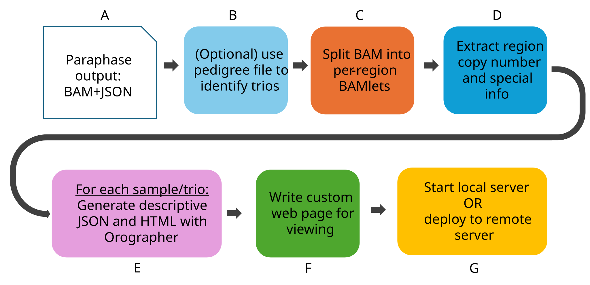

# User Guide

## Installation
Paraviewer requires **Python 3.10+** and dependencies declared in **`pyproject.toml`**. The generated site uses in-browser visualization via [orographer](https://github.com/PacificBiosciences/Orographer).

We recommend installing from conda, for example via mamba:
```bash
mamba create -n paraviewer_env pip "python>=3.10" paraviewer
mamba activate paraviewer_env
```

You may also install from source:
```bash
mamba create -n paraviewer_env pip "python>=3.10"
mamba activate paraviewer_env
git clone https://github.com/PacificBiosciences/Paraviewer.git
cd Paraviewer
pip install .
```

## How to run
### Paraviewer command-line arguments
These can be viewed after installation by running `paraviewer create -h` in the terminal.

You must pass **exactly one** of `--paraphase-dir` or `--ptcp-dir`, plus `--outdir` and `--ref`.

```text
$ paraviewer create --help

ParaViewer v1.1.0
usage: paraviewer create [-h] --outdir OUTDIR [--paraphase-dir PARAPHASE_DIR] [--ptcp-dir PTCP_DIR] --ref REF [--gtf GTF] [--include-only-regions INCLUDE_ONLY_REGIONS [INCLUDE_ONLY_REGIONS ...]]
                         [--exclude-regions EXCLUDE_REGIONS [EXCLUDE_REGIONS ...]] [--pedigree PEDIGREE] [--include-only-samples INCLUDE_ONLY_SAMPLES [INCLUDE_ONLY_SAMPLES ...]]
                         [--exclude-samples EXCLUDE_SAMPLES [EXCLUDE_SAMPLES ...]] [--max-reads-per-haplotype MAX_READS_PER_HAPLOTYPE] [--threads THREADS] [--clobber] [--verbose]

Process paraphase or puretarget results and generate interactive HTML viewer with orographer plots.

options:
  -h, --help            show this help message and exit

Required:
  --outdir OUTDIR       Path to output directory - should not already exist
  --paraphase-dir PARAPHASE_DIR
                        EITHER path to paraphase result directory.
  --ptcp-dir PTCP_DIR   OR path to PureTarget Carrier Panel result directory.
  --ref REF             Path to reference FASTA file

Filtering:
  --include-only-regions INCLUDE_ONLY_REGIONS [INCLUDE_ONLY_REGIONS ...]
                        Region names to include; others excluded.
  --exclude-regions EXCLUDE_REGIONS [EXCLUDE_REGIONS ...]
                        Space-delimited list of region names to exclude.
  --include-only-samples INCLUDE_ONLY_SAMPLES [INCLUDE_ONLY_SAMPLES ...]
                        Sample IDs to include; others excluded.
  --exclude-samples EXCLUDE_SAMPLES [EXCLUDE_SAMPLES ...]
                        Space-delimited list of sample IDs to exclude.

Annotation:
  --gtf GTF             Optional path to bgzip+tabix GTF/GFF3 for gene track.
  --pedigree PEDIGREE   Optional GATK-format PED; unrepresented samples excluded.

Other:
  --max-reads-per-haplotype MAX_READS_PER_HAPLOTYPE
                        Maximum number of reads to show per haplotype.
  --threads THREADS     Number of worker processes, up to CPU count (default 1)
  --clobber             Overwrite output directory if it already exists
  --verbose             Print verbose output for debugging purposes
```

The **parent directory** of `--outdir` must exist. The output directory itself must not exist unless you pass **`--clobber`**.

Plot intervals come from each region's `phase_region` field in the Paraphase JSON (e.g. `38:chr6:32013300-32046200`). Older Paraphase outputs without `phase_region` are not supported.

### Basic WGS usage
To run Paraviewer on WGS [Paraphase](https://github.com/PacificBiosciences/paraphase) output directory, use the following command:
```bash
paraviewer create \
    --outdir {output directory path} \
    --paraphase-dir {paraphase output directory path} \
    --ref {reference fasta}
```

### Basic PTCP usage
To run Paraviewer on PureTarget Carrier Panel data from [PTCP](https://github.com/PacificBiosciences/ptcp) output directory, the command is the same except the PTCP directory argument is named `--ptcp-dir`:
```bash
paraviewer create \
    --outdir {output directory path} \
    --ptcp-dir {PTCP output directory path} \
    --ref {reference fasta}
```

### Results
Either of these workflows will generate a new website directory at `{output directory path}`. To browse it, you can run the paraviewer deploy command to generate a local server:
```bash
$ paraviewer deploy -h

ParaViewer v1.1.0
usage: paraviewer deploy [-h] --outdir OUTDIR [--port PORT]

Start a simple HTTP server to serve generated paraviewer HTML and orographer plots.

options:
  -h, --help       show this help message and exit
  --outdir OUTDIR  Directory path containing HTML and JSON files to serve
  --port PORT      Port number to serve on (default: 8000)
```

For the above PTCP usage, this would be:
```bash
$ paraviewer deploy --outdir {same output directory path as used for the 'create' command}

ParaViewer v1.1.0
Serving plots from: my_dir
Server running at http://localhost:8000/

Press Ctrl+C to stop the server
```

You may then load the `http://localhost:8000/` url in your browser to view.

**Note**: Paraviewer sites also support loading on an external server (such as GitHub Pages) for remote access.

For help in navigating the site's table view, click the `Show Help` button at the bottom of the in-browser page.

### Advanced usage
Paraviewer supports several advanced arguments for experiment customization. These apply equally to WGS or PureTarget Paraviewer usage.

* **Pedigree** — Used to identify trios. See [PED format](https://gatk.broadinstitute.org/hc/en-us/articles/360035531972-PED-Pedigree-format).
  * `--pedigree my_cohort.ped`

**Regions**

* **Include only regions** — Space-delimited region keys to keep in the output. Names are case-insensitive; **each name must appear** in at least one input Paraphase JSON (unknown names are an error). The exact set of included regions will depend on your Paraphase/PTCP run. Example:
  * `--include-only-regions smn1 rccx`
* **Exclude regions** — Space-delimited region keys to drop. Each name must exist in the input JSON. The `--include-only-regions` and `--exclude-regions` arguments are mutually exclusive; use only one or the other. Example:
  * `--exclude-regions smn1`

**Samples**

* **Include only samples** — Space-delimited sample IDs to keep; others are excluded. If none of the given names match discovered samples, Paraviewer exits with an error. Names that do not match any sample are skipped with a warning. Example:
  * `--include-only-samples my_fun_sample1 my_fun_sample2`
* **Exclude samples** — Space-delimited sample IDs to drop. The `--include-only-samples` and `--exclude-samples` arguments are mutually exclusive; use only one or the other. Example:
  * `--exclude-samples my_boring_sample1 my_boring_sample2`

## Algorithm notes
Paraviewer follows this graphically described path to generate review sites:
<h1 align="center"></h1>
