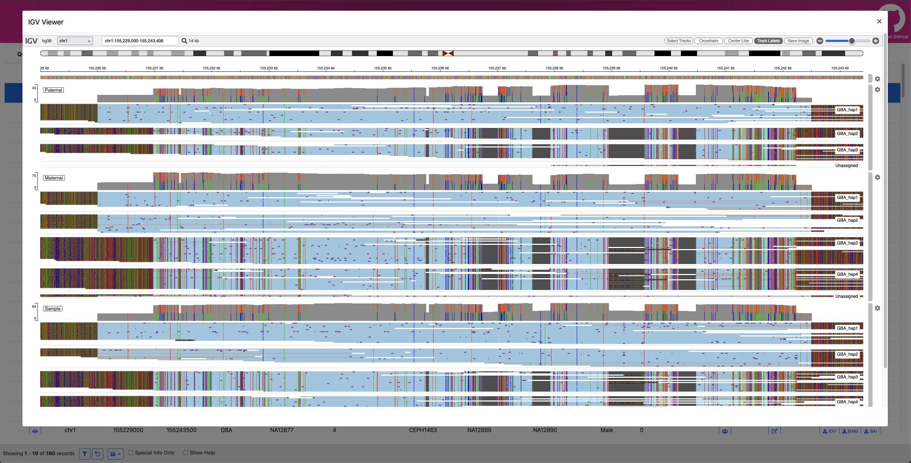

<h1 align="center"></h1>

# Paraviewer

## A viewer for [Paraphase](https://github.com/PacificBiosciences/paraphase)

Paraviewer reads the result directory from Paraphase and uses the files within (per-sample BAM, JSON, and VCF files) to generate a serverless website with a powerful table viewer and various visulization aids. Paraviewer assists in variant prioritization and haplotype review for the complex genomic regions called by Paraphase.

### Note: Paraviewer is new software!
Paraviewer is in an early-release status. We welcome users to try it out and report issues that arise. New features and improvements will be coming soon.

### Overview
Paraviewer can be installed from source and run on Mac or Linux systems. It requires an output directory from Paraphase or PTCP as input and generates a self-contained website for easy result review.

For details, see [User Guide](docs/user_guide.md)

The resulting website includes a variant table with entries for each sample/region included in analysis. The table supports several filtering features via clicking fields in the table or via a fitlering window from the bottom control bar.

Each row also features a static IGV screenshot image for a quick look, an option to open a dynamic IGV.js window in browser, or options to download regional BAM files with accompanying IGV viewer sessions.

If an experiment is run with trios present and annotated via a pedigree file, the table will also include rows for each trio present. These rows have the same viewing options as individual samples, although no specific BAM download buttons (the BAMs for each sample can still be individually downloaded).

#### Screenshot of Paraviewer trio visualization (IGV.js):

<h1 align="center"></h1>

## Support information
Paraviewer is a pre-release software intended for research use only and not for use in diagnostic procedures. 
While efforts have been made to ensure that SVTopo lives up to the quality that PacBio strives for, we make no warranty regarding this software.

As Paraviewer is not covered by any service level agreement or the like, please do not contact a PacBio Field Applications Scientists or PacBio Customer Service for assistance with any HiPhase release. 
Please report all issues through GitHub instead. 
We make no warranty that any such issue will be addressed, to any extent or within any time frame.

### DISCLAIMER
THIS WEBSITE AND CONTENT AND ALL SITE-RELATED SERVICES, INCLUDING ANY DATA, ARE PROVIDED "AS IS," WITH ALL FAULTS, WITH NO REPRESENTATIONS OR WARRANTIES OF ANY KIND, EITHER EXPRESS OR IMPLIED, INCLUDING, BUT NOT LIMITED TO, ANY WARRANTIES OF MERCHANTABILITY, SATISFACTORY QUALITY, NON-INFRINGEMENT OR FITNESS FOR A PARTICULAR PURPOSE. YOU ASSUME TOTAL RESPONSIBILITY AND RISK FOR YOUR USE OF THIS SITE, ALL SITE-RELATED SERVICES, AND ANY THIRD PARTY WEBSITES OR APPLICATIONS. NO ORAL OR WRITTEN INFORMATION OR ADVICE SHALL CREATE A WARRANTY OF ANY KIND. ANY REFERENCES TO SPECIFIC PRODUCTS OR SERVICES ON THE WEBSITES DO NOT CONSTITUTE OR IMPLY A RECOMMENDATION OR ENDORSEMENT BY PACIFIC BIOSCIENCES.